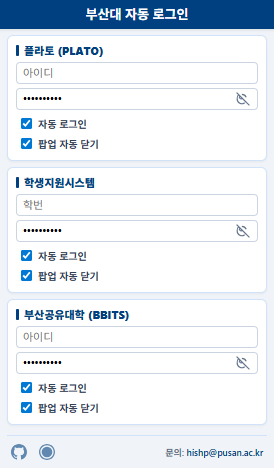

# PLATO & 학지시 & 공유대학 통합 자동 로그인 프로그램 (Chrome Extension)

부산대학교 PLATO, 학생지원시스템, 부산공유대학 이용 시 발생하는 반복적인 로그인 절차를 자동화하는 도구입니다.

---

## 1. 개발 배경
본 프로그램은 부산대학교 조선해양공학과 학부생으로서 대학 생활 중 겪는 실질적인 불편함을 개선하기 위해 기획되었습니다.

* **반복적인 인증 요구**: PLATO 및 학생지원시스템 접속 시마다 발생하는 수동 로그인 과정의 비효율성.
* **불필요한 인터페이스 노출**: 사이트 접속 시 화면을 가리는 다수의 공지사항 팝업 및 주기적인 비밀번호 변경 안내 화면.
* **접속 단계의 복잡성**: 부산공유대학(BBITS) 로그인 시 매번 소속 대학을 선택해야 하는 번거로움.

이러한 요소들을 자동화 로직으로 처리하여 시스템 접근 시간을 단축하고 사용 편의성을 높이고자 하였습니다.

---

## 2. 개발 및 업데이트 과정
기존의 단순한 입력 보조 도구에서 시작하여, 사용자 보안과 다양한 플랫폼 지원을 목표로 고도화하였습니다.

* **초기 버전**: PLATO 자동 로그인 및 팝업 닫기 기능 구현.
* **중기 버전**: 학생지원시스템(Onestop) 및 부산공유대학(BBITS) 연동 지원 확대.
* **최신 버전 (v1.17)**: 
    * 크롬 확장 프로그램 표준인 **Manifest V3**로 완전 전환.
    * 데이터 저장 방식을 브라우저 전용 보안 저장소(`chrome.storage.local`)로 변경하여 보안성 강화.
    * 학생지원시스템 비밀번호 변경 안내 화면 자동 통과 로직 반영.

---

## 3. 주요 기능 명세

### A. 통합 자동 로그인 (Auto-Login)
* **PLATO**: 접속 즉시 로그인 폼을 감지하여 저장된 계정 정보를 주입하고 로그인을 완료합니다.
* **학생지원시스템**: 통합 로그인(SSO) 연동을 통해 별도의 조작 없이 세션을 연결합니다.
* **부산공유대학(BBITS)**: 로그인 과정에서 소속 대학('부산대학교')을 자동으로 선택하여 입력 단계를 간소화합니다.

### B. 팝업 및 안내
* **공지 팝업 관리**: 각 사이트의 공지사항 팝업창을 자동으로 닫거나 화면에 표시되지 않도록 차단합니다.
* **변경 안내 무시**: 학생지원시스템 로그인 시 주기적으로 나타나는 '비밀번호 변경 안내' 팝업을 감지하여 자동으로 통과 처리합니다.

### C. 사용자 편의 기능
* **사이트별 개별 설정**: 설정 팝업 창을 통해 각 사이트별 자동 로그인 및 팝업 차단 활성화 여부를 독립적으로 관리할 수 있습니다.

---

## 4. 데이터 보안 및 정책
* 모든 계정 정보는 사용자의 브라우저 내부 보안 저장소(`chrome.storage.local`)에만 국한되어 저장됩니다.
* 입력된 정보는 어떠한 경우에도 외부 서버로 전송되거나 공유되지 않으며, 오직 로컬 환경 내에서만 관리됩니다.
---

## 5. 개발자 정보 및 지원
* **이메일**: hishp@pusan.ac.kr
* **웹스토어**: [PLATO 자동 로그인 설치 페이지](https://chromewebstore.google.com/detail/plato-%EC%9E%90%EB%8F%99-%EB%A1%9C%E%B7%B8%EC%9D%B8/alfanhjkmennhlhicpinigkgkifknamm)
