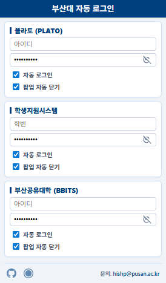
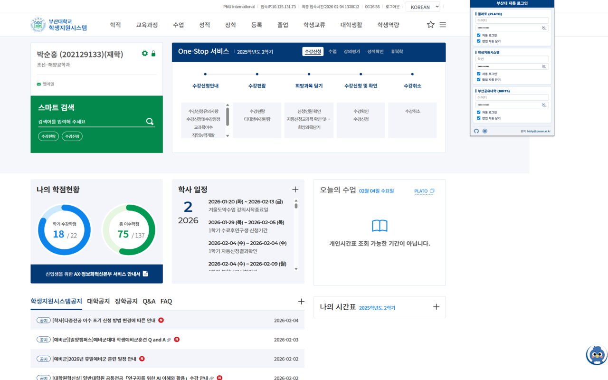

# PLATO & 학지시 & 공유대학 통합 자동 로그인 프로그램 (Chrome Extension)

부산대학교 PLATO, 학생지원시스템, 부산공유대학 이용 시 반복되는 로그인 절차를 자동화하는 크롬 확장 프로그램입니다.

---

## 1. 개발 배경
부산대학교 재학 중 겪는 실질적인 불편함을 개선하기 위해 제작되었습니다.

* **반복적인 로그인**: PLATO 및 학생지원시스템 접속 시 매번 발생하는 수동 로그인 과정.
* **공지 팝업**: 사이트 접속 시 화면을 가리는 다수의 공지사항 팝업 및 비밀번호 변경 안내 화면.
* **접속 단계 번거로움**: 부산공유대학(BBITS) 로그인 시 매번 소속 대학을 선택해야 하는 문제.

---

## 2. 업데이트 내역

* **v2026.09.07**:
    * 부산공유대학 LMS(`lms.bbits.ac.kr`) 캘린더 위젯 추가 (VOD 진도율 및 과제 제출 여부 실시간 추적).
    * 강의 일정을 시작일이 아닌 실제 마감일(Due Date) 기준으로 배치.
    * 플라토 및 공유대학 캘린더의 지난 날짜를 완료 여부와 무관하게 회색으로 통일.
    * 교과과정 페이지에서 '홈' 버튼 클릭 시 1회성 홈 화면 유지 (홈에서 새로고침 시 교과과정으로 자동 이동).
    * 캘린더 갱신 중 기존 데이터 유지 및 상단 프로그레스 바 표시.
    * 강좌명 접두사 정리 및 캘린더 최대 너비(1200px) 설정.
    * 설정 팝업에 '공유대학 캘린더 표시' 항목 추가 및 체크박스 순서 통일.
    * 플라토 개발/테스트 서버(`dev-plato.pusan.ac.kr`, `dev-plato.ac.kr`) 자동 로그인 지원.
* **v2026.09.04**:
    * 2026년도 플라토 UI 개편에 맞춘 로그인 로직 대응.
    * 플라토 교과과정 페이지 학업 캘린더 대시보드 위젯 추가.
    * 세션 만료 감지 및 자동 재로그인 (작업 중이던 URL 보존).
    * Bootstrap 5 공지 팝업 자동 닫기 대응.
    * 부산공유대학 자동 로그인 및 소속 대학 자동 선택 지원.
* **이전 버전**:
    * Manifest V3 전환 및 `chrome.storage.local` 적용.
    * 학생지원시스템 비밀번호 변경 안내 화면 자동 통과.
    * 플라토 및 학생지원시스템 자동 로그인 및 팝업 닫기 구현.

---

## 3. 주요 기능

### A. 자동 로그인
* **플라토 (PLATO)**: `plato.pusan.ac.kr` 및 개발 서버(`dev-plato.pusan.ac.kr`, `dev-plato.ac.kr`), 세션 만료 페이지(`/login.php?errorcode=4`)에서 저장된 계정으로 자동 로그인합니다.
* **학생지원시스템**: SSO 연동을 통해 접속 시 자동으로 세션을 연결합니다.
* **부산공유대학 (BBITS)**: 포털 및 LMS 로그인 시 소속 대학('부산대학교')을 자동 선택하고 로그인합니다.
* **세션 만료 재로그인**: 장시간 미사용으로 세션이 만료되더라도 작업 중이던 페이지 URL을 보존한 채 다시 로그인합니다.

### B. 플라토 학업 캘린더
* **교과과정 페이지 캘린더**: 로그인 후 정규 교과과정 페이지(`allcourse/regular/index.php`) 상단에 월간 캘린더를 표시합니다.
* **일정 수집 및 상태 표시**: 수강 강좌의 과제 마감일과 VOD 강의 출석 인정 기간을 표시합니다.
    * 완료: 녹색, 미완료: 적색, 지난 일정: 회색으로 구분합니다.
    * 날짜 우측 상단에 마감 일정 건수 뱃지를 표시합니다.
* **캐시 렌더링 및 자동 갱신**: 마지막 일정 데이터를 즉시 표시하고, 교과과정 페이지 진입 시 백그라운드에서 최신 데이터를 1회 자동 갱신합니다.
* **갱신 중 기존 데이터 유지**: 새로고침 중에도 기존 일정을 유지하며 상단 프로그레스 바로 진행 상태를 표시합니다.
* **상세 활동 패널**: 날짜를 클릭하면 하단에 강좌명, 교수명, 과제/강의명, 마감 기간, D-Day, 바로가기 링크를 표시합니다.
* **월간 이동 및 접기/펼치기**: 이전/다음 달 이동 및 현재 월 복귀를 지원하며, 상단 토글 바로 캘린더를 접거나 펼칠 수 있습니다 (접힘 상태 저장).
* **홈 화면 이동 제어**: 교과과정에서 '홈' 메뉴를 클릭했을 때는 홈 화면을 유지하고, 홈에서 새로고침(F5)을 하거나 다른 경로로 접근하면 교과과정 페이지로 이동합니다.

### C. 부산공유대학 캘린더
* **메인 대시보드 캘린더**: 부산공유대학 LMS(`lms.bbits.ac.kr`) 메인 화면 강좌 목록 상단에 월간 캘린더를 표시합니다.
* **진도율 및 과제 추적**: VOD 강의 진도율(100%) 및 과제 제출 여부를 확인하여 마감일에 일정을 배치합니다.
* **플라토 동일 기능 지원**: 캐시 렌더링, 갱신 중 화면 유지, 상세 활동 패널, 월간 이동, 접기/펼치기 토글을 지원합니다.

### D. 팝업 및 안내 화면 자동 닫기
* **공지 팝업 닫기**: 사이트 접속 시 표시되는 공지사항 팝업창을 자동으로 닫습니다.
* **비밀번호 변경 안내 통과**: 학생지원시스템 접속 시 나타나는 비밀번호 변경 안내 화면을 자동으로 통과합니다.

### E. 설정
* 설정 팝업에서 사이트별 자동 로그인, 팝업 자동 닫기, 캘린더 표시 기능을 개별적으로 ON/OFF 할 수 있습니다.

---

## 4. 데이터 보안
* 모든 계정 정보는 브라우저 내부 로컬 저장소(`chrome.storage.local`)에만 저장됩니다.
* 외부 서버로 전송되거나 공유되지 않습니다.

---

## 5. 개발자 정보 및 지원
* **이메일**: hishp@pusan.ac.kr
* **GitHub**: [https://github.com/hi-shp/plato_auto_login](https://github.com/hi-shp/plato_auto_login)
* **웹스토어**: [PLATO 자동 로그인 설치 페이지](https://chromewebstore.google.com/detail/plato-%EC%9E%90%EB%8F%99-%EB%A1%9C%EA%B7%B8%EC%9D%B8/alfanhjkmennhlhicpinigkgkifknamm)
